# devin-agent-tmux

**Run Codex and Devin CLI agents in parallel, in your browser.** A local-first
agent multiplexer with real TUIs in resizable terminal panes, lifecycle status,
session controls, and a Kanban workflow. Codex tickets can route by task
complexity through OpenRouter and use Exa MCP for research.

**Live app: <https://devin-agent-tmux-client.onrender.com/>**

> The hosted client is the browser front end. Because agents run on *your*
> machine, point it at a local server (`npm run dev`) or a Convex deployment
> (`VITE_CONVEX_URL`, see [Optional: Convex realtime sync](#optional-convex-realtime-sync))
> — the site is a view onto a machine that has `devin` installed, not a place
> your agents run.

Ported from a Claude-Code-based multiplexer to Devin, web-first.

```
┌─ workspaces ─┬──────────────── grid / tabs ────────────────┐
│ ▾ api-fix    │ ┌── devin ▪running 12% ─┐┌── devin ▪waiting ┐│
│   ▪ auth     │ │ » implement the JWT   ││ » migrate the DB ││
│   ▪ schema   │ │   refresh flow…       ││   ⏸ approve rm?  ││
│ ▾ frontend   │ └───────────────────────┘└──────────────────┘│
│   ▪ router   │ ┌── devin ▪idle 41% ────┐┌── + new pane ────┐│
└──────────────┴──────────────────────────────────────────────┘
```

---

## What it does

- **Parallel agents** — 1 / 1×2 / 1×3 / 2×2 / 2×3 layouts of independent `devin`
  sessions, each its own PTY, with draggable dividers. Grid or tab-strip view.
- **Kanban board** — a per-workspace alternative to the terminal grid: write
  tickets, choose Codex or Devin, and press **Start**. Codex defaults to automatic
  model routing; cards show the selected vendor, model, complexity, and reason.
  Each card opens the live terminal so you can watch and reply without leaving
  the board. A workspace's kind (terminal vs board) is fixed at creation.
- **Real Devin, not a reimplementation** — every pane is the actual `devin` TUI.
  Slash commands, the permission dialog, `/model`, `/compact` all work, because
  we launch the CLI rather than reimplementing its client.
- **Devin's own permission ladder** — `auto` / `accept-edits` / `smart` /
  `dangerous`, surfaced per pane instead of Claude Code's binary skip-or-don't.
- **Live status badges** — idle / running / waiting / exited, driven by Devin
  lifecycle hooks. A workspace with an agent blocked on you shows an attention dot.
- **Session import & resume** — browse every past Devin session on the machine and
  relaunch one with `devin -r`, in its original directory.
- **Trace panel** — turn-by-turn replay of a session: prompts, replies, thinking,
  and every tool call paired with its result, duration and structured diff.
- **Context health** — a live `NN%` occupancy estimate per pane, green/amber/red.
- **context.dev pre-registered** — every pane starts with the
  [context.dev](https://context.dev) MCP server already connected: web search,
  scraping, crawling, structured extraction and document parsing, with no
  per-session setup. The key is per workspace, so two workspaces can bill to two
  accounts, and falls back to one default for everything else.
- **Persistence** — workspaces, layouts, sessions and board tickets live in
  `~/.devin-agent-tmux/` as one JSON file per entity. Optionally mirrored to Convex
  for cross-device sync and realtime remote terminals (see below); off by default,
  local-first always.

---

## High-level architecture

```mermaid
flowchart TB
    subgraph browser["Browser — the view"]
        UI["React UI<br/>grid · tabs · sidebar · badges"]
        XT["xterm.js panes"]
        TP["Trace panel<br/>Session picker"]
    end

    subgraph server["Local Node server — the host (your machine)"]
        WS["ws /pty<br/>typed protocol"]
        SUP["PaneSupervisor<br/>node-pty"]
        ACPC["ACP client<br/>JSON-RPC/stdio"]
        HW["HealthWatcher"]
        FS["FileStore<br/>atomic · diffed"]
        CM["ConvexMirror<br/>best-effort"]
    end

    subgraph core["src/core — pure, host-agnostic, unit-tested"]
        L["launch.ts"]
        H["hooks.ts"]
        O["osc.ts"]
        T["trace.ts"]
        C["context-health.ts"]
        W["layout · workspace · status"]
    end

    subgraph devin["Devin CLI — unmodified"]
        TUI["devin TUI<br/>(one per pane)"]
        HOOKS["lifecycle hooks"]
        ACPS["devin acp<br/>session/list · session/load"]
        EXP["--export transcript"]
    end

    UI --> XT --> WS
    TP --> WS
    WS --> SUP --> TUI
    TUI -->|OSC-777| SUP
    HOOKS -->|/dev/tty| TUI
    TUI --> HOOKS
    SUP --> HW
    EXP --> HW
    TUI --> EXP
    WS --> ACPC --> ACPS
    WS --> FS --> CM
    server -.uses.-> core
    style core fill:#2a2438,stroke:#cba6f7
    style devin fill:#1f2d2b,stroke:#a6e3a1
```



**Three seams, deliberately:**

| Seam | Direction | Carries |
|---|---|---|
| **PTY** (`node-pty`) | bidirectional | The live agent. Real TUI, real keystrokes. |
| **Hooks → OSC-777** | agent → app | Status transitions and Devin's session id. |
| **ACP** (`devin acp`) | app → agent, read-only | History: `session/list`, `session/load`. |

`src/core` never imports React, Node or a transport — it is pure functions over
plain data, which is why the launch-argument builder, the OSC scanner, the trace
folder and the context-health estimator are all unit-tested without a browser or
a subprocess.

---

## The interesting problem: Devin has no `--session-id`

To resume a conversation you must know its id. Claude Code lets you *dictate* one
at launch (`--session-id <uuid>`), so the old app pinned an id and stored it.
Devin generates its own slug (`trail-aardwolf`) and offers no such flag — so a
pane could launch an agent and never learn which session it had created.

The fix inverts the direction. **Every Devin hook payload carries a stable
`session_id`**, so we don't tell Devin the id — Devin tells us:

```
 spawn                                                   ┌──────────────┐
   │  devin --config <merged> --export <path> -- 'prompt' │  devin TUI   │
   └─────────────────────────────────────────────────────>│              │
                                                          └──────┬───────┘
                                        SessionStart hook fires  │
                                   {"session_id":"trail-aardwolf"}│
                                                          ┌──────▼───────┐
                                                          │  hook.mjs    │
                                                          └──────┬───────┘
        ESC ] 777 ; pane ; session ; trail-aardwolf BEL          │ /dev/tty
   ┌─────────────────────────────────────────────────────────────┘
   ▼
 OscScanner ──> strips the bytes, emits the id ──> persisted ──> `devin -r` later
```

The same channel carries status, so one mechanism closes two gaps. The scanner
strips the sequence before xterm sees it, so none of this is ever visible in the
pane.

**Other gaps, honestly stated:** Devin has no `--append-system-prompt` (it uses
`rules`/`skills` instead) and no `--fork-session`. Both are out of v1 rather than
faked.

---

## Verification

Measured on this machine against Devin CLI `3000.6.7`. Reproduce with the smoke
scripts in `scripts/`.

**Live pane path** (`node scripts/smoke-pane.mjs`) — spawn → trust prompt →
hooks → OSC → id capture → context health:

```
bytes of pty output  : 5190
trust prompt answered: true
status signals       : ["running","idle"]
devin session id     : trail-aardwolf
context health       : ~2% of 1000000 (claude-opus-4-8-high-fast)
                       cumulative 19326 prompt / 5 completion
```

**History path** (`node scripts/smoke-acp.mjs`) — `session/list`, then a replay
of a real session that did substantial work:

```
session/list -> 49 sessions
  trail-aardwolf                Ping Pong Test
  lofty-utahraptor [LOCKED]     Greeting

trace "Implement plan-b03afdaeb5d4e16d"
  turns           : 7
  tool calls      : 135
  by kind         : {"read":32,"execute":32,"edit":49,"search":6,"other":16}
  paired w/ timing: 135        ← every call matched to its result
  structured diffs: 49
```

**Unit tests**: `npm test` → 94 tests across launch-argument building, the OSC
scanner (including sequences split across reads), the trace fold, layout ops, the
context-health estimator, the context.dev config merge, the per-pane config
directory and ACP error classification.

---

## Run it

```bash
npm install          # postinstall fixes node-pty's spawn-helper exec bit
npm run dev          # ws/pty server + Vite, together
```

Open http://localhost:5173 — or use the hosted client at
<https://devin-agent-tmux-client.onrender.com/> pointed at your machine (via a
Convex deployment; see below).

**Requirements:** Node ≥ 20, a C toolchain for `node-pty`, and `devin` on your
`PATH` (`devin auth login` done once).

### Codex, OpenRouter, and Exa

Codex tickets require `codex` on `PATH` and an `OPENROUTER_API_KEY` in the
server's `.env` (`OPEN_ROUTER_API_KEY` is also accepted; the canonical spelling
wins if both are present). `EXA_API_KEY` enables the invocation-scoped Exa MCP server.
OpenRouter handles both classification and model inference, so charges accrue
to the OpenRouter account even when the configured model vendor is OpenAI.

The bundled model list routes simple, standard, and complex tickets to
`openai/gpt-5.6-luna`, `openai/gpt-5.6-sol`, and `openai/gpt-6-astra`.
Set `AGENT_ROUTING_CONFIG` to an absolute JSON file to change the list or tier
mapping; see [`config/routing.example.json`](config/routing.example.json).

Codex launches directly, avoiding login-shell startup programs, with
workspace-write sandboxing and on-request approvals. On first
use, review the repository and lifecycle hooks in Codex's normal trust
UI (`/hooks`). The app never writes global Codex configuration or bypasses hook
trust. Full setup, routing JSON, session behavior, limitations, and the opt-in
paid smoke check are in [`docs/demo-codex-exa-routing.md`](docs/demo-codex-exa-routing.md).

### context.dev (the default MCP server)

Copy `.env.example` to `.env` and set a key to give every pane the context.dev
tools out of the box:

```bash
cp .env.example .env
# CONTEXT_DEV_API_KEY=ctxt_secret_…
```

This is the fallback. **New workspace** has its own *context.dev API key* field;
a key set there wins for that workspace's panes, and leaving it blank uses the
`.env` one. With neither set, panes simply run without context.dev.

The key is read by the server and never crosses the websocket — the browser is
told only *whether* a default exists, so the dialog can say what a blank field
will do. At spawn, the key is written into that pane's own
`mcp_config.json` at `0600`.

> **Why per pane, and why not just `devin mcp add -s user`?** `--config` cannot
> carry MCP servers — Devin reads them from dedicated `mcp_config.json` files, and
> `--config` overrides only the main config. So each pane gets its own
> `XDG_CONFIG_HOME` pointing at a **shadow** of `~/.config`: every entry symlinked
> through, with a generated `devin/mcp_config.json`. Your own MCP servers, skills
> and rules all still resolve, your global config is never written to, and
> credentials (under `XDG_DATA_HOME`) are untouched, so panes stay signed in.
> `HANDOFF.md` §3 trap 9 has the probes that establish this.

### Optional: Convex realtime sync

Convex is an **additive** layer over the local file store, which stays the source
of truth. Leave it unset and the app runs exactly as before over the local
WebSocket, saying so at startup (`[convex] no CONVEX_URL set — running
local-only`).

```bash
npx convex dev        # provisions a deployment + writes CONVEX_URL to .env.local
```

Then set both keys in `.env` (the browser reads `VITE_*`, the machine agent reads
the unprefixed ones — normally the same values):

```bash
VITE_CONVEX_URL=https://<your-deployment>.convex.cloud
CONVEX_URL=https://<your-deployment>.convex.cloud
VITE_CONVEX_PROFILE=default     # browser and agent must share this
CONVEX_PROFILE=default
```

**What syncs, and what it unlocks.** With Convex configured the machine agent
mirrors and relays through it, so a browser that is **not on the machine** can
watch and drive the same panes:

| Convex table | Holds | Direction |
|---|---|---|
| `profiles` / `workspaces` | store version, active workspace, order, and each workspace's **sessions and Kanban cards** (opaque JSON, same shape as the local files) | agent → mirror, browser reads |
| `terminalPanes` | a rolling snapshot + latest chunk of each pane's PTY output | agent → browser (live terminal) |
| `terminalCommands` | keystrokes, spawns, resizes, kills the browser issues | browser → agent (drained + acked) |
| `machineStatus` | machine presence + whether a default context.dev key exists | agent → browser |
| `realtimeEvents` | status / session-id / exit / health and request replies | agent → browser |

The local file tree remains authoritative: pushes are debounced and
last-write-wins per workspace, every Convex failure is logged once and swallowed,
and a Convex outage costs sync, not your workspaces. Session **and ticket** data
live in `~/.devin-agent-tmux` first and are mirrored to Convex second.

> The generated `convex/_generated/` is committed so the server can start before
> `convex dev` has ever run; it is regenerated whenever you run `convex dev`.

**Try:** pick a layout → **Run Devin** in an empty pane → watch the badge go
`running`; **Sessions…** → **Resume** an old session, or **Trace** one to read it
back. Reload the page — your workspaces come back. `find ~/.devin-agent-tmux`
to see the store.

---

## Design decisions

Each of these was a fork in the road, decided deliberately:

| Decision | Chosen | Why |
|---|---|---|
| Where agents run | **Local-first web** | `devin`, its auth, your repos and git worktrees are all on your machine. A hosted version needs per-user containers — bigger than the app. |
| Pane model | **Real TUI over PTY**, ACP read-only | ACP is a *driver* protocol; it cannot attach to a session a PTY holds (`isLocked`). Driving panes over ACP would mean reimplementing Devin's client. |
| Live trace | **History-only in v1** | Same lock. Live tracing needs a hook event-stream or a SQLite tail; both were designed and deferred rather than half-built. |
| Session store | **Local files + Convex mirror** | Offline-first, inspectable, and a Convex outage costs sync rather than your workspaces. |
| Trace source | **ACP**, not SQLite | `session/list` / `session/load` are supported API. `sessions.db` is richer but internal, unversioned, and would break silently. |
| Repo shape | **Single package** | The monorepo existed to share UI between web and Electron. Web-only removed its reason to exist. |
| Default MCP | **context.dev, per workspace** | Registered per pane via `XDG_CONFIG_HOME` rather than written into your global `~/.config/devin/mcp_config.json` — the app should not change sessions it did not start, and one global file cannot hold two workspaces' keys at once. |
| Design language | **Instrument** | Cold graphite, one brass accent, engraved mono readouts. Specified in `DESIGN.md`, which is authoritative for every colour, type step and spacing value. Dark-first with a designed light mode. |

---

## Layout

```
src/core/     pure logic, no React/Node/transport — all unit-tested
  launch.ts          build `devin …` (the file the whole port turns on)
  hooks.ts           lifecycle hooks + non-destructive user-config merge
  osc.ts             OSC-777 scanner (status + session identity)
  trace.ts           fold ACP session/update into turns and tool calls
  context-health.ts  occupancy from per-turn export deltas
  layout · workspace · status · models · acp

src/server/   the local host
  panes.ts           node-pty supervisor, per-pane config, OSC extraction
  acp-client.ts      short-lived `devin acp` JSON-RPC subprocess
  health.ts          polls each pane's --export transcript
  store.ts           ~/.devin-agent-tmux, atomic + diffed writes (workspaces, sessions, cards)
  convex-mirror.ts   best-effort state mirror + realtime relay (terminal, commands, events)
  protocol.ts        the ws message types, shared with the browser

src/ui/       React + xterm.js
  board · CardDialog · CardDetail   the Kanban board (a per-workspace view)
  backend.ts         one transport, two modes: local WebSocket or Convex realtime
convex/       schema + mux functions (pushState/pullState, terminal I/O, commands, events)
scripts/      node-pty fix, two smoke tests
```

---

## Not in v1

Named, not hidden: agent swarms with per-agent git-worktree isolation and
Merge/Squash/Discard review; voice dictation; portable session bundles; live
tracing of a running pane; multi-user hosting.

The first is the most interesting follow-up, and it should be *designed* rather
than ported — Devin has a native `run_subagent` tool, so an external swarm may be
the wrong abstraction here.
